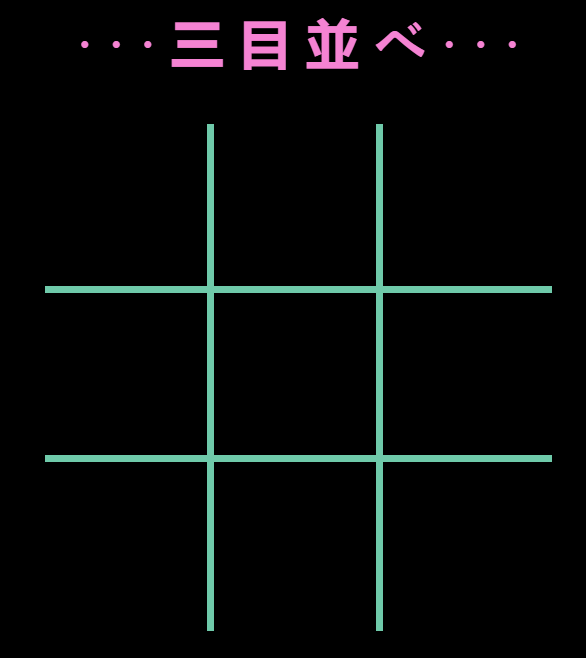

  

<h3 align="center">Tic Tac Toe</h3>

---

 Tic Tac Toe classic game 

    

## 📝 Table of Contents

- [About](#about)
- [Usage](#usage)
- [Built Using](#built_using)
- [Authors](#authors)

## 🧐 About 

First project like student of Full Stack Developer in GeeksHubs Academy using JavaScript.

## 🎈 Usage 

Open your favourite browser, link this url: https://sarasq13.github.io/tic-tac-toe/  and start the game!

## ⛏️ Built Using 

- HTML
- CSS 
- JavaScript

## ✍️ Authors 

- [@SaraSQ13](https://github.com/kylelobo) - Idea & Initial work

